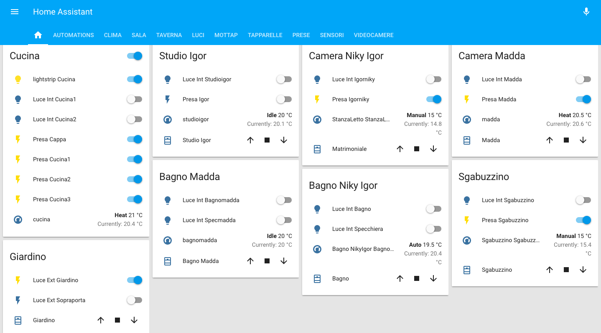
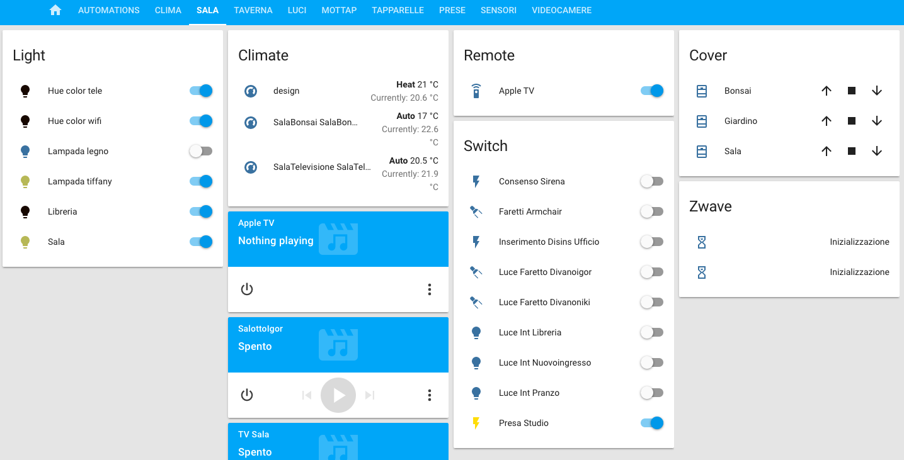
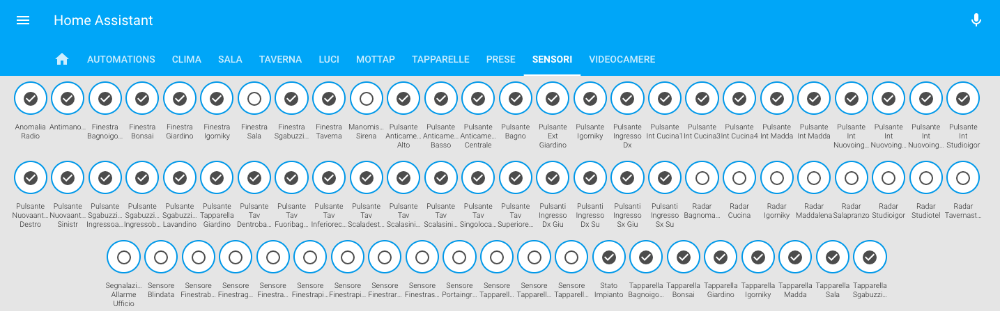
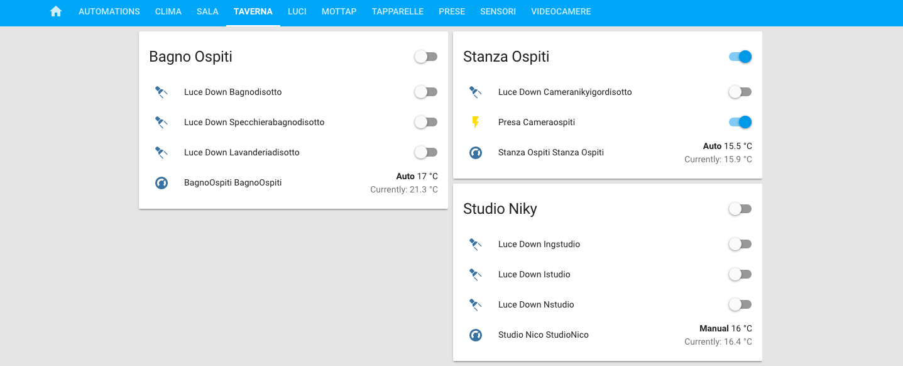
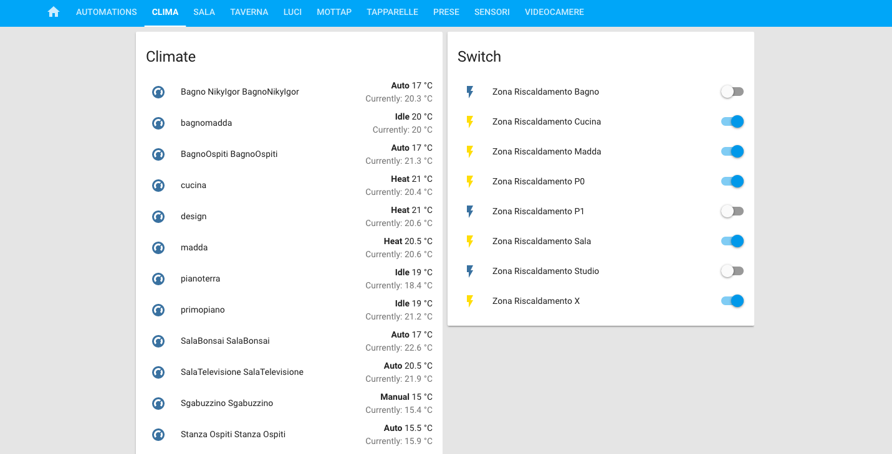

# Homeassistant Template Example By Igor

Home assistant Configuration (YAMLs)

This is my Home Assistant Configuration created with hasbian on a Raspberry Pi 3.

- Android Devices (iPads, iPods, iPhones)
- General view all rooms except Living room

- Living Room 
.   

- All the sensors

- Basement and heating system

